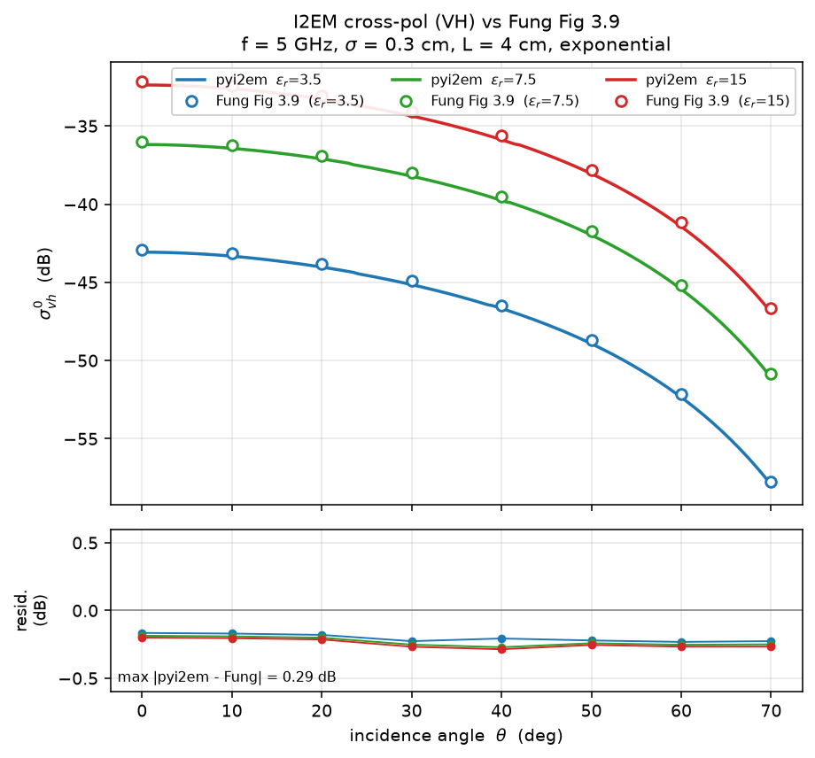
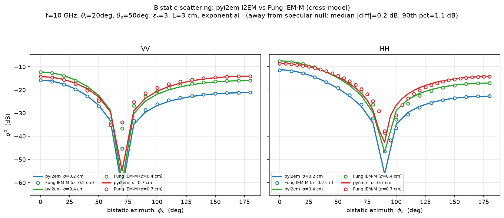

# pyi2em

Python bindings for the I2EM rough-surface scattering and emissivity model.

Reference: Ulaby, F.T. and Long, D.G. (2014). Microwave Radar and Radiometric Remote Sensing. University of Michigan Press.

## Install


```bash
pip install pyi2em
```

Notes on wheels vs source builds

- PyPI wheels bundle required native libraries, including GSL and embedded cubature routines. End users do not need system packages.
- Source builds require GSL available via pkg-config. The cubature integration code is compiled into the extension automatically.

From source

- Ubuntu: `sudo apt-get install -y cmake build-essential libgsl-dev`
- macOS: `brew install cmake gsl`

Then

```bash
pip install .
```

Note: The cubature library (hcubature/pcubature) is fetched automatically during
build; you do not need to install a system package for it. GSL remains a system
dependency for source builds.

### Development with pixi (recommended for source builds)

[pixi](https://pixi.sh) provides a fully reproducible build/dev environment from
the lockfile — including the GSL and C++ toolchain — so you do **not** need to
install any system packages (no `apt`/`brew`). The environment is defined in the
`[tool.pixi.*]` tables of `pyproject.toml`; `pixi.lock` pins exact versions.

```bash
# Install pixi (one time): https://pixi.sh/latest/#installation
pixi install        # resolves toolchain + GSL, builds pyi2em editable
pixi run test       # run the test suite
pixi run validate   # run the acceptance checks
pixi run example    # run example.py
```

After editing the C++ sources, force a fresh native recompile:

```bash
pixi run rebuild
```

## Test
```bash
pytest -q
```

Or, inside the pixi environment: `pixi run test`.

## Usage

The high-level Python API exposes three functions. Units are GHz, meters, and degrees throughout.

1) Emissivity

```python
from pyi2em import emissivity

eh, ev = emissivity(
    freq_ghz=5.3,
    rms_height_m=0.0025,
    corr_length_m=0.10,
    theta_deg=30.0,
    er_complex=complex(11.3, 1.5),
    correl="gaussian",         # 'exponential' | 'gaussian' | 'x_power' | 'x_exponential'
)
print(eh, ev)  # linear emissivities
```

2) Monostatic backscatter (scalar or array incidence)

```python
import numpy as np
from pyi2em import sigma0_backscatter

thetas = np.array([20.0, 30.0, 40.0])
sig = sigma0_backscatter(
    freq_ghz=5.0,
    rms_height_m=0.01,
    corr_length_m=0.05,
    theta_deg=thetas,                 # scalar or array
    er_complex=complex(15.0, 3.0),
    correl="gaussian",
    include_hv=True,
    return_db=True,                   # return dB (default)
)
print(sig["hh"], sig["vv"], sig["hv"])  # arrays in dB
```

3) Bistatic backscatter

```python
from pyi2em import sigma0_bistatic

sig = sigma0_bistatic(
    freq_ghz=5.0,
    rms_height_m=0.01,
    corr_length_m=0.05,
    thi_deg=40.0,
    ths_deg=40.0,
    phs_deg=180.0,
    er_complex=complex(15.0, 3.0),
    correl="gaussian",
    xcoeff=1.0,
    return_db=True,
)
print(sig["hh"], sig["vv"])  # dB
```

Correlation options: 'exponential' | 'gaussian' | 'x_power' | 'x_exponential'.

Notes
- sigma0_* return dB by default; set return_db=False for linear values.
- sigma0_backscatter(theta_deg=...) accepts a scalar or a NumPy array.
- emissivity returns linear values in [0, 1].

## Validation

The cross-pol (VH) channel is validated against the published reference from
Fung and Chen, *Microwave Scattering and Emission Models for Users* (Artech House, 2010),
Fig. 3.9 — dielectric variation with exponential correlation
(f = 5 GHz, σ = 0.3 cm, L = 4 cm). pyi2em reproduces the reference curves to
**within ~0.3 dB** across incidence angles 0–70° and ε_r = 3.5 / 7.5 / 15.



Regenerate with `python docs/make_xpol_figure.py`; the numerical check lives in
`tests/test_xpol_reference.py`.

### Bistatic (cross-model)

The bistatic model is referenced to the IEM-M single-surface
bistatic program (Fung and Chen, 2010, Figs 6.1/6.2 — azimuthal scattering at
f = 10 GHz, θ_i = 20°, θ_s = 50°, ε_r = 3, L = 3 cm, exponential). pyi2em
implements I2EM (Ulaby & Long 2014) and Fung's reference is IEM-M so this 
is a labeled **cross-model** comparison. Away from the specular null the two agree to a
**median ~0.2 dB** across azimuth for σ = 0.2/0.4/0.7 cm. Divergence is limited to 
a narrow specular-null notch, indicating a small null-position shift between the 
formulations.



Regenerate with `python docs/make_bistatic_figure.py`.

## Reference

Fung, A.K. and Chen, K.S.(2010), *Microwave Scattering and Emission Models for Users*, Artech House  
Ulaby, F.T. and Long, D.G.(2014), *Microwave Radar and Radiometric Remote Sensing*, The University of Michigan Press


## License and Notices

- Wrapper: MIT (see `LICENSE`)
- GSL: GPL-licensed dependency; the `NOTICE` and `COPYING.GPL` files are included.
